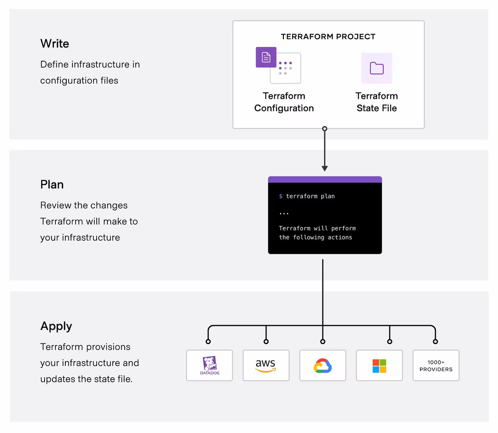

# Infrastructure as a Code - IAC 

## Roteiro

- [Descrição](#descricao)
- [Terraform](#terraform)
  - [HCL](#hcl)
  - [Estado](#estado)
  - [Provider](#provider)
  - [Modulo](#modulo)
  - [Registry](#registry)
  - [Recurso](#recurso)
  - [Data Source](#data-source)
  - [Variáveis](#variaveis)
  - [Outputs](#outputs)
- [Exercício Prático](#exercise)
- [Links/Referências](#links)

## Descrição <a name="descricao"></a>

Infrastructure as Code (IAC), ou Infraestrutura como Código, é uma abordagem na qual a infraestrutura é gerenciada e provisionada usando código de maneira automatizada e programática. Em vez de configurar servidores, redes e outros recursos manualmente, os profissionais usam linguagens de programação ou ferramentas específicas para descrever a infraestrutura desejada em formato de código.

Com o IAC, a infraestrutura pode ser tratada da mesma forma que o código de software tradicional, o que traz benefícios como:

- **Reprodutibilidade:** A infraestrutura pode ser facilmente replicada em diferentes ambientes, garantindo consistência e eliminando erros de configuração.
- **Agilidade:** Alterações na infraestrutura podem ser feitas rapidamente, pois são simplesmente alterações no código, que podem ser versionadas, revisadas e implantadas de forma controlada.
- **Controle de Versão:** O código que descreve a infraestrutura pode ser versionado em sistemas de controle de versão como Git, permitindo o rastreamento de alterações ao longo do tempo e a reversão para versões anteriores, se necessário.
- **Automatização:** A automação é central no IAC, o que reduz o tempo e os esforços necessários para implantar e gerenciar a infraestrutura.

Ferramentas populares de IAC incluem o Ansible, Terraform, Chef, Puppet e CloudFormation, entre outros. Essas ferramentas oferecem uma maneira eficaz de gerenciar e automatizar a infraestrutura em escala, tanto em ambientes locais quanto em nuvem.

## Terraform <a name="terraform"></a>

Terraform é uma ferramenta de IAC desenvolvida pela HashiCorp. Ela permite aos usuários definir e provisionar de maneira declarativa a infraestrutura, incluindo servidores, redes, armazenamento e outros recursos, utilizando arquivos de configuração chamados de "HCL" (HashiCorp Configuration Language).

Com o Terraform, os usuários descrevem a infraestrutura desejada em um arquivo de configuração, especificando os recursos necessários e suas configurações. Esses arquivos descrevem o estado desejado da infraestrutura, e o Terraform é responsável por planejar e executar as mudanças necessárias para alcançar esse estado.



Principais características do Terraform incluem:

- **Declarativo:** Os usuários descrevem a infraestrutura desejada em um arquivo de configuração, sem se preocupar com os detalhes de como esses recursos serão provisionados.
- **Multi-Cloud:** O Terraform suporta múltiplos provedores de nuvem, como AWS, Azure, Google Cloud, além de provedores de infraestrutura local, permitindo a gestão unificada da infraestrutura em ambientes híbridos e multi-nuvem.
- **Planejamento e Alterações Incrementais:** Antes de aplicar qualquer alteração na infraestrutura, o Terraform realiza um plano de execução, mostrando quais recursos serão criados, modificados ou removidos. Isso ajuda a evitar mudanças não intencionais e a entender o impacto das alterações propostas.
- **Automação:** O Terraform automatiza o processo de provisionamento da infraestrutura, permitindo a implantação rápida e consistente de recursos.
- **Gerenciamento de Estado:** O Terraform mantém um estado do ambiente de infraestrutura gerenciado, o que permite que ele entenda as relações entre os recursos provisionados e realize mudanças de forma incremental e segura.

O Terraform é amplamente utilizado na comunidade de DevOps e por equipes de operações para gerenciar a infraestrutura de forma eficiente e escalável, fornecendo uma abordagem padronizada e automatizada para o provisionamento e gerenciamento de recursos.

### Estado <a name="estado"></a>

No Terraform, "estado" refere-se ao estado atual da infraestrutura gerenciada pelo Terraform. O estado é um arquivo que registra os recursos provisionados e suas configurações. Ele fornece ao Terraform informações sobre o que está atualmente implantado e ajuda a determinar quais mudanças precisam ser feitas para chegar ao estado desejado definido no código Terraform.

O estado é crucial para o Terraform porque permite que ele gerencie a infraestrutura de forma eficaz, mantendo o controle das relações entre os recursos, as dependências e as configurações. Ele também ajuda o Terraform a calcular e aplicar as alterações de maneira segura e precisa, garantindo que a infraestrutura permaneça consistente e alinhada com o código definido pelo usuário.

### Provider <a name="provider"></a>

No Terraform, um "provider" é um plugin que permite ao Terraform interagir com um provedor de nuvem, serviço de infraestrutura ou recurso externo. Os providers são responsáveis por traduzir as definições de recursos declaradas no código Terraform em ações específicas na API do provedor correspondente.

Por exemplo, se você estiver usando o AWS como provedor de nuvem, você usaria o provider "aws" no seu código Terraform para declarar recursos como instâncias EC2, buckets S3, ou grupos de segurança.

Os providers fornecem os seguintes recursos:
- **Recursos:** Definem os recursos que podem ser gerenciados pelo Terraform dentro do provedor, como máquinas virtuais, redes, bancos de dados, etc.
- **Data Sources:** Permitem ao Terraform importar dados existentes de um provedor, como informações sobre uma instância EC2 ou uma subnet.
- **Providers Configuration:** Os providers são configurados no arquivo de configuração do Terraform (geralmente main.tf) com as credenciais necessárias para acessar o provedor, como chaves de acesso, tokens de API, etc.

O Terraform suporta uma ampla variedade de providers, incluindo provedores de nuvem populares como AWS, Azure, Google Cloud, bem como provedores de software como Kubernetes, Docker, e muitos outros. Isso permite que os usuários gerenciem recursos em várias plataformas e serviços usando a mesma linguagem declarativa do Terraform.

### Registry <a name="registry"></a>

No Terraform, o "registry" é um repositório online de módulos Terraform disponibilizados pela comunidade e pelos provedores oficiais. Ele permite que os usuários descubram, compartilhem e reutilizem módulos prontos para uso em suas próprias infraestruturas.

O registry Terraform serve como um mercado centralizado onde os usuários podem encontrar uma ampla variedade de módulos prontos para uso em diferentes provedores de nuvem, serviços de infraestrutura e aplicativos. Ele oferece recursos de pesquisa, classificação e revisão para ajudar os usuários a encontrar os módulos adequados para suas necessidades.

Ao usar o registry Terraform, os usuários podem economizar tempo e esforço, aproveitando módulos pré-criados e testados pela comunidade ou pelos provedores oficiais, em vez de criar tudo do zero. Isso promove a reutilização de código, boas práticas de configuração e colaboração entre os usuários do Terraform.

### Modulo <a name="modulo"></a>

No Terraform, um "módulo" é uma unidade de encapsulamento reutilizável que contém um conjunto de recursos e configurações relacionados que podem ser utilizados para provisionar infraestrutura. Os módulos permitem a modularidade e a reutilização de código, facilitando a organização e a manutenção de configurações complexas de infraestrutura.

Um módulo Terraform geralmente inclui:
- **Recursos:** Definições dos recursos de infraestrutura que serão provisionados, como instâncias EC2, buckets S3, grupos de segurança, etc.
- **Variáveis de Entrada:** Parâmetros configuráveis que permitem que os usuários personalizem o comportamento do módulo, como nome de instância, tamanho de máquina virtual, etc.
- **Saídas:** Valores que o módulo expõe para outros módulos ou configurações Terraform, como IPs públicos, IDs de recurso, etc.

Usar módulos no Terraform traz vários benefícios:
- **Reutilização de código:** Os módulos encapsulam lógica e configurações, permitindo que sejam facilmente reutilizados em várias partes de um projeto ou em projetos diferentes.
- **Abstração:** Os módulos ocultam detalhes de implementação complexos, simplificando o uso e promovendo a consistência nas configurações.
- **Organização:** Os módulos ajudam a organizar o código Terraform de forma mais modular e legível, facilitando a manutenção e o gerenciamento de infraestrutura.
- **Padronização:** Os módulos permitem que as melhores práticas e padrões de configuração sejam compartilhados e aplicados de forma consistente em toda a infraestrutura.

### Recurso <a name="recurso"></a>

No Terraform, um "recurso" é uma unidade fundamental de infraestrutura que pode ser gerenciada pelo Terraform. Um recurso representa um componente específico de infraestrutura, como uma máquina virtual, um banco de dados, um bucket de armazenamento, uma rede virtual, entre outros.

Cada recurso é definido em um bloco de configuração dentro do código Terraform, onde são especificados detalhes como o tipo do recurso, suas propriedades e configurações específicas do provedor de nuvem ou serviço.

Por exemplo, para criar uma instância EC2 na AWS usando o Terraform, você precisaria definir um recurso do tipo `aws_instance` e fornecer informações como o tipo de instância, a região onde será implantada, a chave SSH a ser usada, etc. Um exemplo de como isso pode ser definido no código Terraform é:

```terraform
resource "aws_instance" "exemplo" {
  ami           = "ami-0c55b159cbfafe1f0"
  instance_type = "t2.micro"
  tags = {
    Name = "Exemplo"
  }
}
```
Neste exemplo, `aws_instance` é o tipo de recurso que estamos criando (uma instância EC2 na AWS), e "exemplo" é o nome dado a esse recurso dentro do código Terraform. Os atributos específicos desse recurso, como ami (ID da imagem da máquina virtual), instance_type (tipo de instância) e tags (etiquetas para identificação), são definidos dentro do bloco de configuração do recurso.

Quando você executa o Terraform, ele usa essas definições de recursos para criar, atualizar ou destruir os recursos correspondentes na infraestrutura de acordo com o estado desejado especificado no código Terraform. Essa abordagem declarativa permite que os usuários descrevam a infraestrutura desejada e deixem o Terraform lidar com os detalhes da implementação.

### Data Source <a name="data-source"></a>

No Terraform, um "Data Source" é uma maneira de buscar e usar informações existentes de um provedor de nuvem, serviço de infraestrutura ou recurso externo dentro do seu código Terraform. Enquanto os recursos (definidos pelo bloco resource) são usados para criar ou gerenciar recursos, os data sources são usados para consultar e recuperar informações sobre recursos que já existem.

Os data sources permitem que você integre informações externas à sua configuração do Terraform, o que é útil em várias situações, como:
- **Referenciar recursos existentes:** Você pode usar data sources para consultar informações sobre recursos já existentes e usar esses dados em outros lugares do seu código Terraform.
- **Importar recursos existentes:** Quando você tem recursos que foram criados fora do Terraform, você pode usar data sources para importar esses recursos para o estado do Terraform, permitindo que você gerencie esses recursos usando o Terraform.
- **Consultar informações sobre recursos:** Os data sources podem ser usados para buscar informações como endereços IP, IDs de recursos, nomes, etc., sobre recursos que já existem em sua infraestrutura.

A sintaxe para definir um data source no código Terraform é semelhante à sintaxe para definir um recurso, mas em vez de usar o bloco resource, você usa o bloco data, seguido pelo tipo do data source e suas configurações específicas.

Por exemplo, para consultar informações sobre uma instância EC2 na AWS, você poderia usar o data source `aws_instance` da seguinte forma:

```terraform
data "aws_instance" "exemplo" {
  instance_id = "i-1234567890abcdef0"
}

output "endereço_ip" {
  value = data.aws_instance.exemplo.public_ip
}
```

Neste exemplo, o data source `aws_instance` é usado para consultar informações sobre uma instância EC2 com o ID especificado. Em seguida, o endereço IP público dessa instância é recuperado usando a saída public_ip do data source e é exibido como uma saída do Terraform.

### Variáveis <a name="variaveis"></a>

No Terraform, as "variáveis" são usadas para definir valores que podem ser reutilizados em várias partes do seu código Terraform. Elas fornecem uma maneira de parametrizar e personalizar suas configurações, permitindo que você torne seu código mais flexível e reutilizável.

As variáveis no Terraform podem ser usadas para diferentes fins, como:
1. **Parametrização de configurações:** Você pode usar variáveis para definir valores que podem variar entre diferentes ambientes (por exemplo, desenvolvimento, teste, produção), como nomes de recursos, tamanhos de instância, chaves de acesso, etc.
2. **Reutilização de código:** Variáveis permitem que você defina valores uma vez e os use em vários lugares do seu código Terraform, evitando duplicação e promovendo a consistência.
3. **Organização e legibilidade:** O uso de variáveis torna seu código mais organizado e legível, pois separa as configurações estáticas dos valores que podem mudar com o tempo ou com base no ambiente.

As variáveis no Terraform podem ser definidas de várias maneiras, incluindo:
- **No arquivo de configuração do Terraform:** Você pode definir variáveis diretamente no seu arquivo de configuração principal (geralmente `main.tf`) usando o bloco variable.
- **Em arquivos separados:** Você também pode definir variáveis em arquivos separados e carregá-los no seu código Terraform usando a diretiva terraform.tfvars ou por meio de arquivos de configuração específicos usando a opção `-var-file`.
- **Passadas via linha de comando:** Você pode passar valores de variáveis diretamente via linha de comando ao executar o Terraform, usando a opção `-var`.

Por exemplo, você pode definir uma variável para o nome de uma instância EC2 da seguinte forma:

```terraform
variable "nome_instancia" {
  type    = string
  default = "minha-instancia"
}
```

Então, em qualquer lugar do seu código onde você precisar usar esse nome, você pode se referir à variável `var.nome_instancia`.

As variáveis podem ser de vários tipos, como string, número, lista, mapa, etc., e podem ter valores padrão, restrições de tipo e descrições. Elas oferecem flexibilidade e poder ao seu código Terraform, permitindo que você adapte suas configurações conforme necessário.

### Outputs <a name="outputs"></a>

No Terraform, os "outputs" são usados para expor informações sobre os recursos provisionados após a execução de um plano de infraestrutura. Eles permitem que você capture e exiba valores específicos de recursos, como endereços IP, IDs, URLs, etc., que podem ser úteis para outros processos ou para os usuários finais.

Os outputs são definidos no código Terraform usando o bloco `output`. Cada saída pode conter um ou mais valores que são extraídos dos recursos provisionados durante a execução do Terraform.

Por exemplo, suponha que você tenha provisionado uma instância EC2 na AWS e deseje expor o endereço IP público dessa instância como um `output`. Você poderia fazer isso da seguinte maneira:

```terraform
output "endereço_ip" {
  value = aws_instance.exemplo.public_ip
}
```

Neste exemplo, `endereço_ip` é o nome da saída, e `aws_instance.exemplo.public_ip` é o valor que está sendo capturado. Quando você executa o Terraform e ele provisiona a instância EC2, ele também exibirá o endereço IP público da instância como uma saída no final da execução.

Os outputs são úteis para várias finalidades, incluindo:
- **Comunicação de informações importantes:** Os outputs podem ser usados para comunicar informações importantes sobre a infraestrutura provisionada, como URLs de aplicativos, endereços IP, IDs de recursos, etc.
- **Integração com outros sistemas:** Os outputs podem ser consumidos por outros sistemas ou ferramentas para automatizar tarefas ou realizar ações com base nas informações expostas.
- **Documentação:** Os outputs podem servir como uma forma de documentação automatizada, fornecendo detalhes sobre a infraestrutura provisionada que podem ser facilmente acessados e compartilhados.

## Exercício Prático <a name="exercise"></a>

Utilizar provider do GitHub para configurar proteção de branch no repositório utilizando Terraform
**Bonus:** Aplicar Terraform usando CI / CD

## Links/Referências <a name="link"></a>

- [IAC](https://cratedb.com/blog/infrastructure-as-code-part-one)
- [OpenTofu](https://opentofu.org/)
- [Terraform](https://developer.hashicorp.com/terraform/docs)